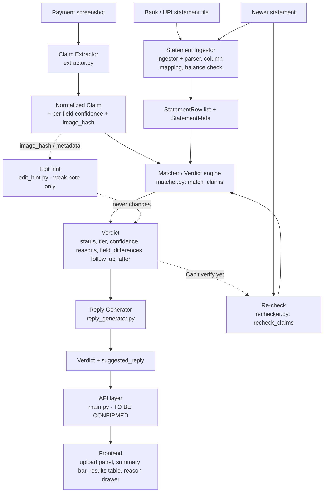

# PayZen — Architecture

Decision-support tool: compares payment screenshots against the receiver's own statement and reports evidence-based verdicts. The statement is the stronger evidence; AI/vision is used only to read screenshots; matching is deterministic and explainable.

## Components and ownership
| Component | File(s) | Owner | State |
|---|---|---|---|
| Claim extractor + normalizers + image hash | `backend/app/services/extractor.py` | Alizah | Implemented; no real vision provider plugged in (mock + "none configured" default) |
| Statement ingestion (loader, mapping, parser, balance chain, report) | `ingestor.py` and related | Zunairah | Implemented by teammate; public function names not reviewed here |
| Matcher / verdict engine (ladder, one-to-one, duplicates, coverage) | `backend/app/services/matcher.py` | Alizah | Implemented |
| Reply generator | `backend/app/services/reply_generator.py` | Alizah | Implemented (English) |
| Re-check workflow | `backend/app/services/rechecker.py` | Alizah | Implemented |
| Edit hint | `backend/app/services/edit_hint.py` | Alizah | Implemented (weak signal) |
| Shared contracts | `backend/app/models.py` | Team (frozen) | Claim, StatementRow, StatementMeta, Verdict |
| API layer | `backend/app/main.py` | Team | **TO BE CONFIRMED** — routes were not reviewed here |
| Frontend | upload panel, summary bar, results table, reason drawer | Umaima | Implemented by teammate; display of all six statuses to be verified |

## Boundaries and flows
- **Extractor** is the only component that touches image bytes. It returns a Claim and keeps no copy.
- **Matcher** consumes only structured Claims/Rows/Meta; no I/O, no clock, no randomness. Replies are *not* produced here.
- **Reply generator** reads Verdict fields only and returns text; `attach_replies` returns copies.
- **Re-check** is a thin wrapper around the same `match_claims` — no second set of rules.
- **Edit hint** reads Claim/peer image fingerprints (and optional image bytes) and returns a dict; it has no path into a Verdict.
- **Verdict statuses:** Verified · Likely match · Contradicted · Not found · Duplicate · Can't verify yet.

## Still requires final team integration
Connect extractor, ingestor, `match_claims`, `attach_replies` and `recheck_claims` inside the API layer; choose/plug a vision provider; decide how edit hints are returned; make the frontend render all six statuses, reasons, confidence, field differences and follow-up; upload handling and deployment config. See FINAL_INTEGRATION_CHECKLIST.md.
