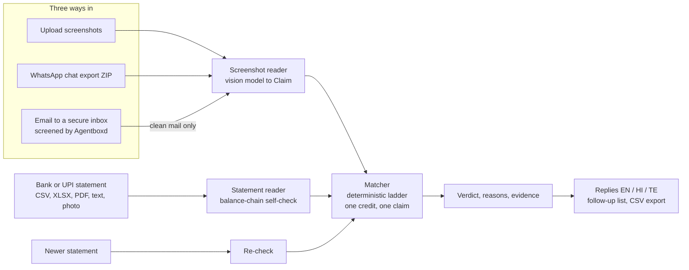

# PayZen — Payment Proof Verifier

**Check the money, not the picture.** PayZen checks the payment screenshots you receive against **your own bank statement** and explains every verdict.

ForgeHacks Online 2026 · Track: **AI + Cybersecurity** · Team: Zunairah · Alizah · Umaima 

**Live app:** https://payzenn.vercel.app/ · **API docs:** https://payzen-z43b.onrender.com/docs 

> PayZen is **decision support, not a fraud detector.** It reports evidence and confidence, never calls a person or a screenshot "fake", and is built around avoiding its worst error: a **false Verified** (a payment marked as paid that never arrived).

**Contents:** [Problem](#the-problem) · [Verdicts](#the-six-verdicts) · [Proven on real data](#proven-on-real-data) · [Try it](#try-it-in-60-seconds) · [How it works](#how-it-works) · [Agentboxd secure email](#secure-email-inbox-powered-by-agentboxd) · [Results](#results) · [Limits](#what-works-and-what-doesnt) · [Privacy](#privacy-and-responsible-use) · [Setup](#setup-and-run) · [Repository](#repository) · [Credits](#credits-tools-and-honest-ai-use) · [Team](#team-and-contributions)

---

## The problem

A payment screenshot is not proof of payment. It can be edited, come from a fake payment app, be reused by several people, or describe a payment that never arrived. The reliable proof is the **receiver's own bank or UPI statement**, but checking hundreds of screenshots against it by hand is slow and error-prone. A wrong call either accepts money that never came or wrongly accuses someone who paid.

**Why it matters:** collecting money by UPI screenshot is how small organisations and sellers actually work, and they have no fraud team. PayZen gives them a check that is fast, explained and fair: the people who paid are not accused, and the people who did not are not waved through.

**Who it's for:** fest and club treasurers, housing societies, donation, tuition and trip collectors, and WhatsApp or Instagram sellers who collect through plain UPI.

**How it answers the track prompt:**

| Verb | What PayZen does |
|---|---|
| Recognize | Flags contradicted amounts, wrong references, reused screenshots and missing payments |
| Verify | Checks every claim against the receiver's own statement, with evidence |
| Prevent | Screens incoming email for spoofing, prompt injection and phishing before anything is read; unique payment link and QR prototype |
| Respond | Polite replies in English, Hindi and Telugu; a follow-up list; re-check against a newer statement |

*Honesty note:* its not sure that AI itself drives UPI screenshot fraud, so we frame this as fraud enabled by modern technology (photo editors, fake payment apps, reused screenshots). AI agents that read email are, however, a new target for prompt injection, which is why the email channel is screened.

---

## The six verdicts

Each screenshot gets one verdict, with plain-language reasons, the matched statement row and a confidence.

| Verdict | Meaning |
|---|---|
| **Verified** | Exact 12-digit reference **and** amount match a statement credit; nothing conflicts |
| **Likely match** | A plausible credit exists but reference or identity proof is incomplete |
| **Contradicted** | The reference is on the statement but details differ; the exact differences are shown |
| **Not found** | No compatible credit in a period the statement covers |
| **Duplicate** | Shares a reference or identical image with another claim |
| **Can't verify yet** | The statement ends before the payment; upload a newer one and re-check |

Alongside the verdicts: money totals (verified, likely, at risk, pending), a follow-up list with a ready-to-send reply per payer, and CSV and printable export.

Field-by-field behaviour: [ `docs/API_INTEGRATION.md`](docs/API_INTEGRATION.md)


---

## Proven on real data

Most of our labelled evaluation uses synthetic data, because that is the only way to seed dozens of known fakes without exposing anyone's records. But a tool that reads bank statements should be proven on the real thing, so before release the team ran PayZen locally on a **real bank statement** and a **real UPI payment**. Nothing from these tests is stored, committed or published.

| Test | Input | Result |
|---|---|---|
| **1. Real statement, hard format** | A real bank statement as a **PDF** (multi-page tables, repeated headers, long wrapped UPI narrations) | **87 rows read** (15 Jul to 10 Oct 2026); **balance chain held on all 87 rows** |
| **2. Real payment** | A real Google Pay screenshot (names covered) and that statement | **Verified, 97% confidence**: same reference, same amount, same day, matched statement row shown |
| **3. Fabricated payment** | A made-up ₹500 screenshot with a reference that does not exist | **Not found, 74% sure it's missing**, plus a polite reply asking the payer for the UTR |

- The balance chain is the proof of the reading: one misread row, amount or column would break the arithmetic.
- Test 2 shows a real payment accepted for the right reasons; test 3 shows an invented one refused, on real ground truth.
- The reply to the fabricated claim is a request, not an accusation.

---

## Try it in 60 seconds

1. Open https://payzenn.vercel.app/ and click **Try sample data**. It shows all six verdicts and needs no model call.
2. To try the real pipeline, use the synthetic files in `data/synthetic/` (screenshots, statements) and `data/synthetic/demo/` (small files that trigger each prompt: password PDF, ambiguous dates, missing row, picture consent).
3. The free host sleeps when idle, so the first request can take about a minute.

---

## How it works



**Design principle: the model proposes, the arithmetic verifies.** AI helps *read*; every decision about a payment is deterministic code, so every verdict is explainable and testable.

### 1. Statement reader
Reads CSV, XLSX, pasted text, text PDF (multi-page, repeated headers, password) and, with the user's consent, photos and scans. Rules and an optional language model (which sees only column names and masked sample rows) propose which column is the date, narration, debit, credit and balance. The **balance-chain check** then verifies the proposal: every row's balance must equal the previous balance plus credit minus debit. If it fails, PayZen retries and asks the user one question. A file is never rejected for its format.

### 2. Screenshot reader
A Gemini vision model returns the text as printed. Deterministic normalizers clean the amount, time and 12-digit reference, attach a confidence per field and compute an image fingerprint. Weak or ambiguous fields are left empty, never guessed.

### 3. Matcher
Theres no AI here, on purpose. Evidence ladder, strongest first:

| Tier | Evidence | Verdict |
|---|---|---|
| 1 | High-confidence exact reference **and** equal amount, nothing conflicting | Verified (0.85–0.97) |
| 4 | Reference found, another field differs | Contradicted, with exact differences |
| 2 | No reference proof; equal amount, time within 30 min, similar payer name | Likely match |
| 3 | No reference proof; equal amount and time only | Likely match (low) |
| 5 | Nothing found, claim safely inside the statement's coverage | Not found |
| — | Coverage cannot support a conclusion | Can't verify yet |

Rules that apply to the whole ladder:
- Only a high-confidence reference plus an equal amount can verify; tiers 2 and 3 never can.
- Only statement **credits** count as evidence, and amounts are compared after rounding to two decimals.
- **One credit supports one claim**, assigned globally (Hungarian algorithm), not first come first served.
- **Coverage-aware:** a claim at or near the statement's end becomes *Can't verify yet*, never *Not found*.
- **Duplicates** need real evidence (identical files, the same reference, or a corroborated image fingerprint). A fingerprint alone is a note.
- Results are deterministic: same input, same output.

Full rules and confidence formulas: [`docs/TECHNICAL_REFERENCE.md`](docs/TECHNICAL_REFERENCE.md).

### 4. Replies, re-check and edit hint
Replies are deterministic and evidence-only, in three tones (English), with sanitised user text and no accusatory wording. The interface's payer messages come in English, Hindi and Telugu, with user text sanitised and tested to contain no accusatory wording. Re-check re-runs *Can't verify yet* claims through the same matcher against a newer statement. The edit hint (image fingerprints and metadata) is a weak note capped at 0.70 and cannot change a verdict.

| Uses AI | Deliberately does not |
|---|---|
| Reading screenshots; reading photos and scans of statements (consent); suggesting statement columns (a helper; arithmetic decides); screening email (Agentboxd) | The balance check, matching, verdicts, duplicate and coverage logic, replies (templates) |


### 5. Intake
Upload, WhatsApp ZIP and email all feed the same engine, and every claim carries a source tag (Upload / WhatsApp / Email), so one screenshot arriving through two doors is caught as a duplicate.
- **WhatsApp ZIP:** the "export chat with media" file; only real images (checked by file signature), capped counts and sizes (25 by default, 60 at most), nothing written to disk, chat text never given to a model.
- **Email:** see the next section.

---

## Secure email inbox (powered by Agentboxd)

Payment proofs often arrive by email, and an AI system that reads email is a new attack target: a message can carry hidden instructions (prompt injection), spoof a sender or phish. PayZen uses **[Agentboxd](https://agentboxd.com)**, a real email inbox built for AI agents, as its front door, and adds its own checks behind it.

| Step | What happens |
|---|---|
| 1. Screen | Agentboxd scores every incoming message for spoofing, prompt injection and phishing |
| 2. Hold | Suspicious mail is held; it is never opened and its attachments are never downloaded. It appears in the app as a security alert |
| 3. Re-check | Clean mail is checked again by PayZen's own policy (scores and labels) |
| 4. Process | Attachments from clean mail go through the same screenshot or statement pipeline as an upload |
| 5. Isolate | Email text is never given to a model as instructions |

**Tested:** 20 emails (10 clean, 10 malicious): **10/10 malicious stopped, 0/10 clean blocked**, 3/3 statements read. A live test also held an injection attempt. Test details: [`docs/evaluation/email_eval_results.md`](docs/evaluation/email_eval_results.md).

**Honest scope:** in our test all blocking was done by Agentboxd's screening; PayZen's own policy is covered by offline tests. Spoofed senders were not tested, and the test used one sender.

Setup: `AGENTBOXD_API_KEY` (see [Setup](#setup-and-run)).

---

## Results

| What was tested | Result | Details |
|---|---|---|
| **Real bank PDF and real payment** | 87 rows read, balance chain held on all 87; real payment **Verified 97%**; fabricated payment **Not found** | see above
| **Matching rules:** 100 labelled claims (55 genuine, 45 seeded fakes), 5 statement layouts | Accuracy 0.95–0.96; **0/45 fakes Verified**; 0/55 genuine Not found; 5/5 delayed payments resolved by re-check | [`eval/results/results.md`](eval/results/results.md) |
| **Real screenshot reading + matching** (Gemini), 27 claims × 4 conditions (clean, recompressed, resized, photographed) | Amount, reference and time right on **27/27** in every condition; verdict right 25/27; **0/11 fakes Verified**; 0/16 genuine Not found | [`eval/results/screenshot_eval.md`](eval/results/screenshot_eval.md)|
| **Statement reader:** 17 layouts + 2 stress layouts (Indian grouping, Dr/Cr, signed and inverted amounts, newest-first, junk headers, wrapped narrations, merged cells, no header, no balance column, multi-page and password PDFs) | 17/17 and 2/2 match ground truth on every date, amount, balance and reference; balance check passed on 16 (one layout has no balance column) | [`docs/evaluation/ingestion_test_report.md`](docs/evaluation/ingestion_test_report.md) |
| **Ablation:** column-mapping model off vs on | Identical, 17/17 both ways: the model is a safety net, not the source of accuracy | [`docs/evaluation/ablation_results.md`](docs/evaluation/ablation_results.md) |
| **Photo of a statement:** 3 images × 4 conditions | Clean, recompressed, resized: 45/45 rows. Simulated phone photo: 15/45 (dropped or date-shifted row) | [`docs/evaluation/photo_degradation_results.md`](docs/evaluation/photo_degradation_results.md) |
| **Email intake:** 10 clean + 10 malicious | **10/10 malicious stopped**, 0/10 clean blocked, 3/3 statements read | [`docs/evaluation/email_eval_results.md`](docs/evaluation/email_eval_results.md) |
| **Automated tests** | **642 passed** | `python -m pytest tests -q` |

---

## What works and what doesn't

**Works end to end:** all three intake doors; all six verdicts with reasons; re-check; three-language replies; follow-up list; CSV export; statement prompts (green tick, one question, PDF password, picture consent); a deployed app; a real bank PDF read and a real payment verified.

**Known limits:**
- **Bank coverage.** Tested on 17 synthetic layouts and one real bank PDF, not every bank. Unfamiliar layouts ask the user to confirm columns instead of guessing.
- **Photos of statements are best effort.** A tilted photo can drop a row or shift a date, which the balance check cannot see, so picture statements always ask the user to check dates. CSV, XLSX and text PDF are recommended.
- **Reused reference, different person** is labelled Contradicted rather than Duplicate (never Verified). An identical reused image is caught as Duplicate (4/4).
- **Payment link and QR is a prototype.** It only helps future payments; whether a bank copies the payment note into the statement is untested.
- **Free-tier model speed:** about 25 screenshots in 3 minutes.
- Hindi and Telugu replies are machine-drafted; the rest of the interface is English.
- **Out of scope:** cash payments, forged statements (a user downloads their own) and collusion.

---

## Privacy and responsible use

- Everything is processed **in memory**; nothing is stored. A PDF password is used once and not kept.
- **Disclosure:** screenshots are sent to Google Gemini to be read, so the app tells users to use synthetic or blurred images. Statement mapping sends only column names and masked sample rows (digits to 9, letters to x). A **picture of a statement** is sent only after the user ticks a consent box.
- **Untrusted text is escaped** in the interface (email subject, sender, file names).
- **Wording is never accusatory:** "could not be verified", "details differ", "please recheck", with the footer "Decision support. Confirm in your own bank app before acting on high-value payments."
- **Data:** the repo, tests, demo and video use synthetic data only. Real-data checks were run locally on the team's own records; nothing from them is committed. API keys live in environment variables and are never committed.

More: [`docs/PRIVACY_SECURITY.md`](docs/PRIVACY_SECURITY.md).

---

## Setup and run

Requirements: Python 3.10+ and Node 18+.

```powershell
# backend (http://localhost:8000)
python -m venv backend\venv
backend\venv\Scripts\Activate.ps1
pip install -r backend/requirements.txt
cd backend
uvicorn app.main:app --reload

# frontend (http://localhost:5173)
cd frontend
npm install
npm run dev
```

Copy `.env.example` to `.env`. **Without any key** the statement reader still works (rules only) and "Try sample data" works.

| Variable | Used for |
|---|---|
| `GEMINI_API_KEY` | Screenshot reading, statement photos, column-mapping helper (model `gemini-3.1-flash-lite`, override with `GEMINI_MODEL`) |
| `AGENTBOXD_API_KEY` | Secure email inbox |
| `CORS_ORIGINS` (backend host) | Frontend URL, no trailing slash |
| `VITE_API_URL` (frontend host) | Backend URL, no trailing slash |

Deployment notes: [`docs/DEPLOYMENT.md`](docs/DEPLOYMENT.md).

### Reproduce every number

| Result | Command |
|---|---|
| All tests | `python -m pytest tests -q` |
| Statement layouts | `python -m tests.ingestion.test_layouts` |
| Model off vs on | `python -m tests.ingestion.ablation` |
| Photo-of-statement conditions | `python -m tests.ingestion.degradation_eval` |
| Email test | `python -m tests.intake.email_eval baseline`, send the 20 emails, then `... score` |
| Matching rules, 100 claims | `python eval/generate_synthetic.py` then `python eval/run_eval.py` (needs `pip install -r eval/requirements.txt`, `python -m playwright install chromium`) |
| Real screenshot reading | `python eval/screenshot_eval.py` (needs `GEMINI_API_KEY`; about 12 minutes) |
| **Check your own statement locally** | `python -m tests.ingestion.real_check "path\to\statement.csv"` (runs on your machine, nothing stored) |

---

## Repository

```text
backend/app/
  main.py, models.py       API and shared data contracts (Claim, StatementRow, StatementMeta, Verdict)
  ingestion/               statement reading: loader, pdf_loader, vision_loader, mapping, parser,
                           normalize, references, chain (balance check), coverage, pipeline, report
  intake/                  secure email inbox (Agentboxd) and WhatsApp ZIP intake
  services/                extractor, vision_gemini, matcher, rechecker, reply_generator, edit_hint
  payment_links.py         unique payment link and QR (prototype)
frontend/src/              React + Vite app: landing, verify flow, results, reason drawer, follow-up list
eval/                      synthetic data generator, evaluation scripts, results/
data/synthetic/            100 labelled claims, screenshots, statements, demo files, degraded copies
tests/                     unit, ingestion, intake and integration tests
docs/                      architecture, matching rules, API contract, privacy, deployment, evaluation, history
```

---

## Credits, tools and honest AI use

- **Runs in the product:** Google Gemini (screenshot reading, statement photos, column-mapping helper) and Agentboxd (email screening, hackathon Builder plan). Matching, verdicts and the balance check use no AI.
- **Built with** AI coding assistants; the team reviewed, ran and tested the code. Libraries: FastAPI, pandas, openpyxl, pdfplumber, Pillow, React, Vite, Playwright (synthetic screenshots), reportlab (test PDFs only). Hosting: Vercel (frontend), Render (backend).
- **Compared with what exists** (short search, not exhaustive): screenshot-to-spreadsheet extractors and invoice-matching accounting tools exist, and payment gateways avoid screenshots altogether. We did not find a tool that checks a batch of *untrusted* screenshots against the receiver's own statement with explained verdicts, a screened email door and a reply workflow. The contribution is that combination.
- Built during the ForgeHacks build window (October 3–10, 2026) using existing open-source libraries.

---

## Team and contributions

PayZen has three layers that had to fit together exactly: **reading** (statements, screenshots, secure intake), **deciding** (matching and verdicts), and **delivering** (API, interface, evaluation). Each member owned one layer end to end, and each layer is a full system on its own.

### [Umaima](https://github.com/umaima06) — API, interface and evaluation data

- **API:** the backend service and the shared data contracts the layers agree on.
* **Synthetic data and evaluation:** 100 labelled claims, five statement layouts, generated screenshots, ground truth, and matching evaluation scripts.
* **Web Interface:** landing page, three-door intake, CSV export, inline claim editing, follow-up list, printable report, and EN/HI/TE payer messages.
* **Payment link panel in the interface and deployment:** UPI link and QR prototype, live frontend on Vercel and backend on Render.
* **Integration and testing:** API–UI integration, end-to-end real-data tests, cross-channel claim handling, and deployment fixes.


### [Zunairah](https://github.com/Zunairah-k)— statement reading and secure intake
* **Statement reader:** CSV, XLSX, pasted text, text and password-protected PDFs, and consent-based photo/scanned statement extraction.
* **Balance-chain verification:** arithmetic-based column validation, automatic retries and repairs, and user confirmation for uncertain results.
* **Secure email and WhatsApp intake:** Agentboxd integration, phishing and prompt-injection quarantine, attachment routing, and ZIP safety checks.
* **Payment link and QR generator (backend: unique tags, link and QR creation, reconcile by tag):** payer-specific UPI links and QR codes with unique transaction tags.
* **Evaluations and integration:** 17-layout statement tests, model-on/off ablation, photo and real-bank-PDF tests, 20-email security evaluation, and API integration.


###  [Alizah](https://github.com/alizahh-7) — extraction, matching and verdicts
* **Screenshot extraction:** Gemini-based claim extraction, field normalization, per-field confidence, image fingerprinting, and empty fields instead of guesses.
* **Matching engine:** five-tier verification ladder, one-credit-one-claim assignment, duplicate detection, exact contradiction reporting, and coverage-aware verdicts.
* **Replies and re-checks:** deterministic verdict explanations, three reply tones, re-checking with newer statements, and weak image-edit hints.
* **Email integration:** routes screened email attachments into the screenshot extraction and claim-verification pipeline.
* **Testing and documentation:** extraction and matching test suites, integration tests, and documented matching rules and limitations.


---
**PayZen — Payment Proof Verifier**
*Trust the transaction, not the screenshot.*

 AI + Cybersecurity · ForgeHacks Online 2026 · Umaima · Zunairah · Alizah
