# PayZen — Payment Proof Verifier

**Hackathon:** ForgeHacks Online 2026 · **Track:** AI + Cybersecurity
**Team:** Umaima · Zunairah · Alizah

PayZen helps people who collect payments — college-fest treasurers, student societies, donation collectors, WhatsApp/Instagram sellers, tuition collectors and other small payment collectors — check whether the payment screenshots they receive are actually supported by **their own** bank/UPI statement.

> **PayZen is a decision-support tool, not a fraud detector.**
> It reports *evidence* and *confidence*. It never calls a screenshot, a payment or a person "fake" or "fraud" on the strength of a single signal. The receiver's own statement is treated as the stronger source of truth, and the error PayZen works hardest to avoid is a **false Verified**.

---

## Table of contents

1. [The problem](#1-the-problem)
2. [What PayZen does](#2-what-payzen-does)
3. [Architecture](#3-architecture)
4. [Shared data contracts](#4-shared-data-contracts)
5. [Screenshot extraction (claims)](#5-screenshot-extraction-claims)
6. [Statement ingestion](#6-statement-ingestion)
7. [Matching engine and verdicts](#7-matching-engine-and-verdicts)
8. [Verdict statuses in detail](#8-verdict-statuses-in-detail)
9. [Worked example](#9-worked-example)
10. [Suggested replies](#10-suggested-replies)
11. [Re-check workflow](#11-re-check-workflow)
12. [Screenshot signals and the edit hint](#12-screenshot-signals-and-the-edit-hint)
13. [Using the services from Python](#13-using-the-services-from-python)
14. [API and UI integration notes](#14-api-and-ui-integration-notes)
15. [Repository structure](#15-repository-structure)
16. [Setup, running and testing](#16-setup-running-and-testing)
17. [Privacy and security](#17-privacy-and-security)
18. [Responsible-AI design principles](#18-responsible-ai-design-principles)
19. [Evaluation plan](#19-evaluation-plan)
20. [Demo script](#20-demo-script)
21. [Deployment plan](#21-deployment-plan)
22. [Project status and remaining work](#22-project-status-and-remaining-work)
23. [Known limitations](#23-known-limitations)
24. [FAQ and troubleshooting](#24-faq-and-troubleshooting)
25. [Glossary](#25-glossary)
26. [Documentation index](#26-documentation-index)
27. [Team and ownership](#27-team-and-ownership)

---

## 1. The problem

When money is collected through UPI, payers usually send a **screenshot** as proof. A screenshot on its own is weak evidence:

- it can be **edited** (amount, name, date);
- it can be **reused** for several claims or by several people;
- it can be a **duplicate** upload of the same payment;
- it can be **genuine but missing** from the receiver's records;
- it can **disagree** with the real transaction (different amount, payer or time);
- it can describe a payment that simply falls **outside the statement you currently have**.

Checking each screenshot by hand against a long statement is slow and error-prone, and the cost of getting it wrong is real: accepting a payment that never arrived, or wrongly accusing someone who did pay.

PayZen automates the comparison and keeps every result **explainable**.

---

## 2. What PayZen does

A user uploads:

1. **Payment screenshots** from people who say they paid.
2. **The receiver's own bank/UPI statement** (CSV, XLSX, pasted text, text PDF, password-protected PDF, or a scanned/photo PDF).

PayZen then:

1. **Extracts a payment claim** from each screenshot (payer, UPI IDs, amount, time, 12-digit reference, status shown, app style) with a confidence per field.
2. **Normalizes the statement** into transaction rows plus statement-level metadata (coverage period, parse confidence, balance-chain check).
3. **Matches** claims against statement **credits** with a conservative, deterministic ladder.
4. **Assigns one-to-one** — a statement credit can support only one claim.
5. **Detects duplicates and contradictions**, with exact claim-vs-statement differences.
6. **Respects statement coverage** — it never says "not found" about a date the statement does not cover.
7. Produces a **verdict** with reasons and confidence, and a **polite suggested reply**.
8. Lets the user **re-check** unresolved claims when a newer statement arrives.

### Key properties

| Property | How |
|---|---|
| Explainable | Every verdict has a list of plain-language reasons; contradictions list exact values |
| Conservative | Weak evidence can never become **Verified**; fuzzy and image evidence cap at *Likely match* |
| Deterministic | Same input → same assignments, statuses, confidence, reasons (no randomness, no clock) |
| Coverage-aware | Claims after/near the end of the statement → *Can't verify yet*, with a follow-up |
| One credit, one claim | Global assignment (Hungarian algorithm) with documented tie-breaking |
| Non-accusatory | Neutral wording everywhere; duplicate/edit signals are described as evidence, never proof |
| Privacy-minded | The matching/extraction services keep no uploads and call no external services |

---

## 3. Architecture

```mermaid
flowchart TD
    S[Payment screenshot] --> E[Claim extractor<br/>extractor.py]
    E --> C[Normalized Claim<br/>per-field confidence + image hash]
    B[Bank / UPI statement] --> I[Statement ingestion<br/>backend/app/ingestion]
    I --> R[StatementRows + StatementMeta]
    C --> M[Matcher / verdict engine<br/>matcher.py]
    R --> M
    M --> V[Verdict<br/>status, tier, confidence, reasons, differences]
    V --> G[Reply generator<br/>reply_generator.py]
    G --> A[API layer<br/>main.py]
    A --> F[React frontend]
    N[Newer statement] --> I
    V -. Can't verify yet .-> RC[Re-check<br/>rechecker.py]
    N --> RC
    RC --> M
    C -. fingerprint / metadata .-> H[Edit hint<br/>edit_hint.py - weak note only]
    H -. never changes .-> V
```



```text
Screenshot ─► Claim Extractor ─► Claim ──────────────┐
                                                      ▼
Statement ──► Ingestion ──► StatementRows + Meta ──► Matcher ──► Verdict ──► Reply ──► API ──► UI
                                                      ▲                         │
                                       Newer statement ──► Re-check ◄───────────┘ (Can't verify yet)
```

### Responsibilities

| Layer | Component | Owner |
|---|---|---|
| UI | React/Vite app: upload, results table, summary cards, reason drawer, export | Umaima |
| API | Backend API (`main.py`), routing, integration of the services | Umaima |
| Statement ingestion | Loading, format detection, mapping, parsing, coverage, balance chain, privacy masking, vision path | Zunairah |
| Extraction | Screenshot → `Claim` (normalization, confidence, hashing, provider abstraction) | Alizah |
| Matching | Ladder, scoring, assignment, duplicates, coverage, contradictions, verdicts | Alizah |
| Replies / re-check / edit hint | `reply_generator.py`, `rechecker.py`, `edit_hint.py` | Alizah |

**Design principle:** *model proposes, math verifies.* AI/vision may help **read** a screenshot or a scanned statement; every check that matters (amounts, references, coverage, balances, one-to-one assignment) is deterministic code.

---

## 4. Shared data contracts

These Pydantic models live in `backend/app/models.py` and are **frozen**: do not rename fields, change status values or redesign them without team agreement.

### `Claim` — one payment screenshot's claim

| Field | Meaning |
|---|---|
| `claim_id` | Unique id of the claim |
| `source_file` | Uploaded file name (path stripped) |
| `image_hash` | Image fingerprint (`dhash256:<64 hex>` perceptual, or `sha256:<hex>` fallback) |
| `payer_name`, `payer_upi_id` | Who the screenshot says paid |
| `payee_name`, `payee_upi_id` | Who the screenshot says was paid |
| `amount`, `currency` | Claimed amount (float) and currency (`INR` when evidenced) |
| `timestamp` | `YYYY-MM-DDTHH:MM:SS` when date **and** time were read, else `None` |
| `reference` | 12-digit payment reference, or `None` |
| `app_style_guess` | PhonePe / Google Pay / Paytm / BHIM / Amazon Pay / CRED, else `None` |
| `status_shown` | `success` / `failed` / `pending`, else `None` |
| `confidence` | Per-field confidence dictionary (0–1; `0.0` means "not extracted") |
| `extraction_notes` | Short notes about extraction limits |

### `StatementRow` — one normalized transaction

`row_id`, `datetime`, `narration`, `debit`, `credit`, `balance`, `extracted_reference`, `name_hint`, `source_page_or_row`

### `StatementMeta` — the statement as a whole

`coverage_start`, `coverage_end`, `mapping_used`, `balance_chain_result`, `parse_confidence`, `row_count`, `warnings`

### `Verdict` — PayZen's result for one claim

| Field | Meaning |
|---|---|
| `claim_id` | The claim this verdict belongs to |
| `status` | `Verified`, `Likely match`, `Contradicted`, `Not found`, `Duplicate`, `Can't verify yet` |
| `tier` | `1` Verified · `2`/`3` Likely match · `4` Contradicted · `5` Not found · none for Duplicate / Can't verify yet |
| `matched_row_id` | The statement row used as evidence (for Duplicate: the contested row — an evidence pointer, not an assignment) |
| `confidence` | 0–1, rule-based evidence strength (not a measured probability) |
| `reasons` | Ordered, deterministic, human-readable evidence sentences |
| `field_differences` | Exact claim-vs-statement text, for Contradicted only, e.g. `{"amount": "claim=500.0, statement=300.0"}` |
| `follow_up_after` | When a statement covering the claim is needed (Can't verify yet, after/near coverage end) |
| `suggested_reply` | Reply text (filled by the reply generator) |

Field-by-field behaviour: [`API_INTEGRATION.md`](API_INTEGRATION.md).

---

## 5. Screenshot extraction (claims)

**Entry point:** `extract_claim(image_bytes, filename) -> Claim` in `backend/app/services/extractor.py`.

```text
image bytes ─► image hash
            ─► vision provider (pluggable) ─► RAW text fields + provider confidence
            ─► deterministic normalizers   ─► Claim (+ per-field confidence + notes)
```

### Provider abstraction

- `VisionProvider` is the interface a real vision model implements: return the text exactly as read (`"₹ 1,500.00"`, `"1234 5678 9012"`), omit what is not visible.
- **No real provider is configured by default.** The default (`NoProviderConfigured`) extracts nothing and returns an honest empty claim — it never fabricates payment data.
- `MockVisionProvider` is for tests/demos only and labels itself in `extraction_notes`.
- Plug a provider in with `set_default_provider(...)`. No API key is needed for the mock or "none" setups.

### Normalization rules (deliberately conservative)

| Field | Accepted | Rejected → `None` |
|---|---|---|
| Reference | `123456789012`, `1234 5678 9012`, `1234-5678-9012`, `UPI Ref No: 123456789012` | Not exactly 12 digits, several different candidates, letters inside digits (no O→0 or l→1 "repair"), repeated-digit values |
| Amount | `₹300`, `Rs. 300`, `INR 300`, `300/-`, `300.00`, `₹1,00,000`, a bare number | Unmarked numbers inside free text, several different amounts, zero/negative, bad comma grouping |
| Currency | Only when a marker or the provider evidences it | Never assumed |
| Timestamp | Many UPI-app formats, 12/24-hour, day-first numeric dates (`03/04/2026` = 3 April) | Invalid times, years outside 2000–2100; partial date/time is **not padded** |
| Names | Whitespace/zero-width cleanup; ALL-CAPS or all-lower → Title Case | No letters |
| UPI ID | Lower-cased `local@handle`; masked IDs kept with confidence ≤ 0.5 | Invalid shape |
| Status | `success` / `failed` / `pending` | Unrecognised |

### Confidence

Each field gets a value in `[0, 1]`: the provider's own confidence (clamped; garbage → 0), multiplied by small penalties (e.g. reformatted reference ×0.95), or `0.0` when nothing was extracted. A provider that gives a value without confidence is treated as `0.5` ("extracted, but unknown certainty"). These numbers describe *extraction*, not truth.

### Image hash

`dhash256:<64 hex>` is a perceptual difference hash (grayscale 17×16 → 256 bits) that survives resizing and mild recompression. If Pillow is missing or the bytes are not an image, the hash falls back to `sha256:<hex>` (exact bytes only) and a note says so. A perceptual hash is a **weak signal** between screenshots of the same app, which share a template — it is never used alone to call something a duplicate.

---

## 6. Statement ingestion

*(Owned by Zunairah; summarized here so the pipeline reads end to end.)*

Converts different statement formats into the shared `StatementRow` / `StatementMeta`:

- CSV, XLSX, pasted text
- text-based PDFs, password-protected PDFs
- scanned/photo PDFs through the vision path (with user consent)

Responsibilities: file loading, format detection, column mapping, parsing, decimal-safe amounts, coverage detection, balance-chain validation, reference/name extraction, privacy masking, ingestion reports and user-facing errors.

### Calling it from the API

```python
to_shared(
    ingest_statement(
        file_bytes,
        filename,
        password=...,
        allow_vision=...,
    )
)
```

When `result.ok` is `False`, show `result.report.user_message` and use `result.report.error_code`:

| `error_code` | UI action |
|---|---|
| `pdf_password_required` | Ask the user for the PDF password |
| `pdf_password_incorrect` | Ask the user to retry the password |
| `vision_consent_required` | Show the vision-processing consent checkbox |
| `pdf_scanned` | Show the consent checkbox / scanned-document handling |

When `result.report.needs_confirmation` is `True`, show `result.report.mapping_summary` so the user can confirm the detected column mapping.

### What the matcher reads from the statement

| Field | Use |
|---|---|
| `credit` | Only rows with `credit > 0` count as payment evidence |
| `debit` | Never matched as a payment (only used to flag a reference that sits on an outgoing row) |
| `datetime` | Time comparison; exactly `00:00:00` is treated as *date only* |
| `extracted_reference` / `narration` | Exact 12-digit reference (the narration is searched for 12-digit tokens as a fallback) |
| `name_hint` / `narration` | Payer-name and UPI-ID evidence |
| `coverage_start`, `coverage_end`, `parse_confidence` | Coverage logic |

---

## 7. Matching engine and verdicts

**Entry point:** `match_claims(claims, statement_rows, statement_meta=None, config=None) -> List[Verdict]` in `backend/app/services/matcher.py`. One verdict per claim, in the same order as the claims. Pure and deterministic.

### 7.1 The ladder

| Tier | Evidence | Status | Confidence |
|---|---|---|---|
| **1** | Claim reference == statement reference **and** amount == statement credit, no conflicting field | **Verified** | 0.85 – 0.97 |
| **4** | Reference exists on the statement but another important field conflicts | **Contradicted** (+ `field_differences`) | 0.60 – 0.95 |
| **2** | No reference proof; equal amount + time within window + payer identity (name similarity ≥ 0.80, or payer UPI ID in the narration) | **Likely match** | 0.60 – 0.89 |
| **3** | No reference proof; equal amount + time within window only | **Likely match** (low) | 0.35 – 0.60 |
| **5** | No candidate and the claim is safely inside coverage | **Not found** | ≈ 0.55 – 0.75 |
| — | Coverage cannot support a conclusion | **Can't verify yet** | 0.0 |

Rules that hold everywhere:

- **A reference match by itself never verifies.** The amount must match as well.
- **Reference found + something conflicts ⇒ Contradicted.** PayZen does *not* quietly search for another, more convenient candidate.
- **A soft candidate whose row carries a *different* reference is rejected.**
- **Tiers 2 and 3 can never produce Verified.**
- **Only statement credits count.** A debit with the same amount is never evidence of a payment.
- **A screenshot that itself shows a failed payment** is never soft-matched; with a matching reference it is reported as Contradicted.

### 7.2 What counts as "conflicting" for a reference match

| Field | Conflict when |
|---|---|
| `amount` | Claim amount ≠ statement credit (compared to the paisa) |
| `payer_name` | Statement name hint is clearly different (similarity < 0.30) and the payer's UPI ID is not in the narration |
| `timestamp` | Times differ by more than 24 hours (date-only rows: more than one calendar day) |
| `status_shown` | The screenshot shows a failed payment |
| `direction` | The reference appears only on a **debit** row |

Smaller time differences (30 minutes to 24 hours) still verify, with a lower confidence and an explicit reason.

### 7.3 Candidate scoring (for Tiers 2/3 and for ranking competing claims)

```text
points (0–100) = 30 × time proximity
               + 40 × name similarity
               + 20 × (payer UPI ID found in narration)
               + 10 × extraction confidence
```

- Missing evidence scores **0** — it is never treated as a free match.
- Assignment weight = tier bonus (Tier 1 > 2 > 3) + points, so tier always dominates and points break ties inside a tier.
- Time proximity = `1 − Δ / window` (window default **30 minutes**; date-only rows give 0.2 and are capped at Tier 3).

**Name similarity** is order-insensitive and conservative: tokens match exactly (1.0), as an initial (0.6) or as a near-identical spelling (≤ 0.9); the score is scaled down when one name has fewer tokens than the other; one-word names are capped at 0.75. So `Ali` vs `Ali Khan` is **not** "similar", and `Syeda Alizah` vs `ALIZAH SYEDA` is.

### 7.4 One-to-one assignment

1. Generate candidate (claim, credit-row) edges.
2. Score them.
3. Group edges into connected components and solve each component as a **maximum-weight assignment** (Hungarian algorithm), so the *global* best pairing wins rather than first-come-first-served.
4. Each credit row is used **at most once**.
5. Every claim still gets a verdict; claims that lose a credit are *Not found* ("already assigned to claim X") or *Duplicate* (if there is real duplicate evidence).

**Deterministic tie-breaking** (exact ties only): lower `claim_id` wins, then lower input position; rows are ordered by `row_id`, then position. Results do not depend on the order of the uploaded files.

### 7.5 Duplicate detection

Claims are linked only by real evidence:

| Evidence | Strength |
|---|---|
| Byte-identical screenshot file (`sha256:` match) | strongest |
| Same 12-digit reference | strong |
| Identical perceptual hash **plus** same amount within 60 s, or same reference | medium |
| Near-identical hash (≤ 6 of 256 bits) with the same corroboration | weaker |
| Same payer name + amount + time competing for one credit | medium |

An image fingerprint **without** corroboration only adds a note ("not treated as a duplicate"). In each linked group one claim keeps its verdict (assigned/Verified first, then `claim_id` order); the others become **Duplicate** with reasons. If the **same reference** is claimed by **different payer names** and the statement's name cannot tell them apart, nobody is verified automatically — all are Duplicate, because one credit can belong to only one payer. Contradicted claims keep their Contradicted verdict.

### 7.6 Coverage-aware logic

`coverage_end` is the **last covered moment** (a date-only end includes the whole day).

| Situation (no candidate found) | Result |
|---|---|
| Claim comfortably inside coverage (more than one window from both edges) | **Not found** |
| Claim after `coverage_end`, or within one window of it | **Can't verify yet** + `follow_up_after` + "a newer statement is required" |
| Claim before `coverage_start`, or within one window of it | **Can't verify yet** — "an earlier statement is required" |
| Claim has no timestamp / coverage unknown or inverted | **Can't verify yet** — no coverage conclusion is invented |
| Statement empty or `parse_confidence < 0.5` | **Can't verify yet** — absence is not concluded from an unreadable statement |
| Claim currency is not INR, or amount unreadable | **Can't verify yet** |

A match found by **reference** does not depend on coverage metadata.

### 7.7 Confidence calibration

| Outcome | How confidence is computed |
|---|---|
| Verified | 0.97, minus 0.07 if the time is outside the window, 0.04 if the name is only partly similar, 0.02 if the reference was found only in the narration, 0.03 if the screenshot shows "pending", and a small penalty for low reference/amount extraction confidence; floor 0.85 |
| Tier 2 | 0.65 + up to 0.15 (name) + 0.04 (time) + 0.05 (UPI ID); cap 0.89, floor 0.60 |
| Tier 3 | 0.40 + up to 0.14 (time) + 0.04 (weak name); cap 0.60, floor 0.35 |
| Ambiguity | −0.08 when several credits match about equally well; −0.10 for low extraction confidence of amount/time |
| Contradicted | 0.90 for an amount conflict, 0.75 time, 0.70 name/direction, 0.60 failed status; +0.02 per extra conflict, cap 0.95 |
| Duplicate | By evidence: 0.95 identical file, 0.85 same reference, 0.80 / 0.70 corroborated image match, 0.65 conflicting payer names |
| Not found | 0.70 (0.75 if the claim had a reference), scaled by statement parse confidence |
| Can't verify yet | 0.0 — it does not pretend that absence proves anything |

These are rule-based scores, **not** calibrated probabilities. All thresholds live in `MatchConfig` (`time_window_minutes=30`, `reference_time_conflict_hours=24`, `name_similar_threshold=0.80`, `name_conflict_threshold=0.30`, `near_hash_bits=6`, `follow_up_delay_hours=24`, `min_parse_confidence=0.5`).

---

## 8. Verdict statuses in detail

| Status | What it means | What the user should do |
|---|---|---|
| **Verified** | An exact reference and amount match a statement credit; nothing conflicts | Normally accept; the reasons show the evidence |
| **Likely match** | A plausible credit exists but reference/identity proof is incomplete (Tier 2 stronger, Tier 3 weak) | Confirm the transaction reference in the UPI/bank app |
| **Contradicted** | The statement has a transaction with this reference but details differ (e.g. amount) | Review the listed differences; ask the payer to recheck |
| **Not found** | No compatible credit inside the statement's coverage (or the only one was used by another claim) | Ask for the transaction details; the payment may not have arrived |
| **Duplicate** | The claim shares evidence with another submitted claim | Check whether the payment was submitted twice or by two people |
| **Can't verify yet** | The statement can't support a conclusion (usually the payment is after the statement ends) | Provide a newer/earlier statement, then re-check |

None of these statuses is an accusation. They describe what the evidence supports.

---

## 9. Worked example

Statement (coverage 1 Oct 2026 – 7 Oct 2026 23:59:59, parse confidence 0.95):

| row_id | time | credit | reference | name hint |
|---|---|---|---|---|
| r1 | 07 Oct 10:30 | 500.00 | 123456789012 | SYEDA ALIZAH |
| r2 | 07 Oct 11:00 | 300.00 | 987654321098 | — |
| r3 | 07 Oct 12:00 | 200.00 | — | — |

Claims and results (real output of the matcher, shortened):

| Claim | Submitted | Status | Tier | Row | Confidence |
|---|---|---|---|---|---|
| **A** | ₹500, ref 123456789012, "Syeda Alizah", 10:31 | **Verified** | 1 | r1 | 0.97 |
| **B** | ₹500, ref 987654321098, 11:01 | **Contradicted** | 4 | r2 | 0.90 |
| **C** | ₹200, no reference, 12:05 | **Likely match** | 3 | r3 | 0.52 |
| **D** | ₹750, 13:00 | **Not found** | 5 | — | 0.68 |
| **E** | ₹400, 9 Oct 09:00 | **Can't verify yet** | — | — | 0.0 |
| **F** | ₹500, same reference as A, 10:32 | **Duplicate** | — | r1 | 0.85 |

**A — Verified**
- Exact 12-digit reference 123456789012 matches statement row r1.
- Amount matches: claim INR 500.00 vs statement credit INR 500.00.
- Transaction time is within 30 minutes of the claim (differs by 1 min).
- Payer name is similar to the statement name hint (similarity 1.00).
- Also submitted as claim(s) F; marked Duplicate.

**B — Contradicted** · `field_differences = {"amount": "claim=500.0, statement=300.0"}`
- Reference 987654321098 appears on statement row r2, but the amount differs: claim INR 500.00 vs statement credit INR 300.00.
- Because the reference exists on the statement, the claim is reported as a mismatch instead of searching for another match.

**C — Likely match (Tier 3)**
- Amount matches and the time is within 30 minutes (5 min).
- Reference evidence is missing; payer identity could not be confirmed.
- *Amount and time alone are not enough to verify this payment; treat it as a possible match only.*

**D — Not found**
- Claim time is inside the statement coverage, not near either boundary.
- No statement credit of INR 750.00 exists within 30 minutes of the claim time.

**E — Can't verify yet** · `follow_up_after = 2026-10-10T09:00:00`
- Claim timestamp is after the statement coverage end; a newer statement is required.

**F — Duplicate**
- Same 12-digit reference as claim A; claim A is treated as the primary submission (Verified).
- Duplicate evidence is not proof of misconduct; please confirm with the payer(s).

Note how claim B is **not** "rescued" by r1 (which also has ₹500), and how r1 verifies only A even though F carries the same evidence.

---

## 10. Suggested replies

`generate_reply(verdict, tone="professional", language="en")` builds a polite, deterministic reply **only from the verdict's own fields**. It adds the matched row, an evidence-strength label (high ≥ 0.85, medium ≥ 0.60, else low), tier-specific cautions, the exact differences for Contradicted, and a next step.

| Status | Reply (headline + typical follow-on) |
|---|---|
| Verified | "The payment appears to be verified. The reference and amount match a transaction in the provided statement. Matched statement entry: r1. Evidence strength: high." |
| Likely match | "The payment is likely to match a statement transaction based on the amount, timing and available supporting details. … Please confirm the transaction reference in your UPI/bank app to be sure." |
| Contradicted | "We found a transaction with the same reference, but some payment details differ from the submitted claim. Differences found: amount (submitted: 500.0; statement: 300.0). Please recheck your UPI/bank app and share the correct transaction details." |
| Not found | "We could not find a matching transaction within the available statement coverage. Please recheck your UPI/bank app and share the transaction details (reference number, amount and time)." |
| Duplicate | "This payment appears to duplicate another submitted payment claim. … Please confirm whether this payment was submitted more than once." |
| Can't verify yet | "This payment cannot be verified from the current statement coverage. Please provide a statement that covers at least 10 Oct 2026 09:00." (or a newer/earlier statement, or the missing amount/time) |

- **Tones:** `professional` (default), `friendly` (adds a thank-you line), `brief` (headline only).
- **Language:** English only today; every sentence lives in a per-language catalog, so Hindi/Telugu can be added later. An unsupported language raises an error instead of silently replying in the wrong language.
- **Safety:** the generator never uses accusatory words (tested for every status and tone); values echoed from the claim/statement have control characters stripped and are capped at 80 characters.
- `attach_replies(verdicts)` returns **copies** with `suggested_reply` filled; nothing else on the verdict changes.

---

## 11. Re-check workflow

1. First run: `verdicts = match_claims(claims, rows_v1, meta_v1)`.
2. Some claims come back **Can't verify yet** (typically: the payment is after the statement ends).
3. A newer statement arrives. Call `recheck_claims(claims, rows_v2, meta_v2, previous_verdicts=verdicts)`.
4. Only previously unresolved claims (or claims with no previous verdict) are re-run — through the **same** `match_claims`, so no rule is weakened.
5. Credits whose reference already belongs to a Verified/Likely claim are not reused, and an explanatory reason is added.
6. `merge_rechecked(verdicts, new)` swaps the new verdicts in by `claim_id`; `recheck_changes(verdicts, new)` returns `before → after` for each claim.

Possible outcomes after a re-check: Verified, Likely match, Contradicted, Not found, Duplicate, or still Can't verify yet (e.g. the newer statement also ends too early).

---

## 12. Screenshot signals and the edit hint

- The **image hash** is computed at extraction time and used as supporting duplicate evidence (see 7.5).
- The **edit hint** (`compute_edit_hint(claim, peers, image_bytes)`) returns `{"signal": "none"|"low"|"medium", "reason": …, "confidence": 0–1}` with confidence capped at 0.70. It can only fire for:
  - a screenshot visually near-identical to another claim's while payment fields differ (*medium* if the reference is the same, *low* if only the amount/reference differs);
  - image metadata that names a known image editor (*medium*).
- It is a **note for a human reviewer**. It is not part of `Verdict`, cannot produce Verified/Contradicted/Duplicate, and says "none" when there is no evidence. It is also easy to trigger falsely (apps look alike) and easy to defeat (metadata can be stripped), and its reason text says so.

---

## 13. Using the services from Python

```python
from app.services.extractor import extract_claim, MockVisionProvider, set_default_provider
from app.services.matcher import match_claims, MatchConfig
from app.services.reply_generator import attach_replies
from app.services.rechecker import recheck_claims, merge_rechecked, recheck_changes
from app.services.edit_hint import compute_edit_hint

# 1. screenshots -> claims  (needs a vision provider; none is configured by default)
claim = extract_claim(image_bytes, "proof1.png")

# 2. statement -> rows + meta   (ingestion; see section 6)
# rows, meta = ...

# 3. verify, then attach replies
verdicts = attach_replies(match_claims(claims, rows, meta))

# optional: tune thresholds
verdicts = match_claims(claims, rows, meta, MatchConfig(time_window_minutes=45))

# 4. later: a newer statement arrives
new = recheck_claims(claims, rows_v2, meta_v2, previous_verdicts=verdicts)
verdicts = merge_rechecked(verdicts, new)

# 5. optional weak note for a reviewer (never a verdict)
hint = compute_edit_hint(claim, peers=claims, image_bytes=image_bytes)
```

For an offline demo without any vision API, use the labelled mock provider:

```python
set_default_provider(MockVisionProvider({
    "amount": "₹500", "reference": "1234 5678 9012",
    "timestamp": "07 Oct 2026, 10:30 AM", "payer_name": "SYNTHETIC PAYER",
}))
```

---

## 14. API and UI integration notes

Planned API flow:

```text
1. Upload payment screenshots     → extract claims
2. Upload bank/UPI statement      → ingest → rows + meta
3. Run verification               → match_claims(claims, rows, meta)
4. Attach replies                 → attach_replies(verdicts)
5. Show verdicts + evidence
6. Re-check unresolved claims against a newer statement
7. Export results
```

| Route | Purpose |
|---|---|
| `GET /health` | Liveness check |
| `POST /claims/upload` | Screenshots in, list of `Claim` out |
| `POST /statement/upload` | Statement in (optional `password`, `allow_vision`), returns `{rows, meta, preview}` |
| `POST /verify` | `{claims, rows, meta}` in, list of `Verdict` out (replies attached) |
| `POST /recheck` | `{claims, rows, meta, previous_verdicts}` in, re-checked `Verdict`s out |
(see [`API_INTEGRATION.md`](API_INTEGRATION.md), which documents the exact service-level contract and labels anything unconfirmed).

### What the UI should show

| Element | Show |
|---|---|
| Summary | Counts per status (all six) |
| Results table | Claim, amount, payer, status, tier, confidence |
| Reason drawer | Every item in `reasons`; `matched_row_id` |
| Contradicted | `field_differences` as claim-vs-statement pairs |
| Can't verify yet | `follow_up_after` and the reply text asking for a newer statement |
| Duplicate | The reasons explaining *why* (same reference / identical file / …) |
| Reply | `suggested_reply`, copyable |
| Edit hint (if shown) | As a small, clearly weak note — never as a status |
| Ingestion errors | `report.user_message`; act on `report.error_code` (password, consent, mapping confirmation) |

Wording for the UI should stay neutral: "could not be verified", "details differ", "please recheck", never "fake" or "fraud".

---

## 15. Repository structure

```text
PayZen/
├── backend/
│   ├── app/
│   │   ├── ingestion/       statement parsing: loader, mapping, parser, normalize, references,
│   │   │                    coverage, chain (balance check), pdf_loader, vision_loader,
│   │   │                    pipeline, report, messages, adapter
│   │   ├── services/
│   │   │   ├── extractor.py         screenshot -> Claim
│   │   │   ├── ingestor.py          statement -> rows + meta + preview (used by the API)
│   │   │   ├── matcher.py           match_claims
│   │   │   ├── reply_generator.py   suggested replies
│   │   │   ├── rechecker.py         recheck_claims
│   │   │   └── edit_hint.py         weak edit note
│   │   ├── main.py          API layer
│   │   └── models.py        frozen shared contracts
│   └── requirements.txt
├── frontend/                React + Vite UI
│   └── src/
│       ├── components/      UploadPanel, SummaryBar, ResultsTable
│       ├── App.tsx, ReasonCard.tsx, EditClaim.tsx
│       ├── api.ts, types.ts, exportCsv.ts, sampleData.ts
├── eval/
│   ├── generate_synthetic.py    synthetic statements + screenshots (evaluation use only)
│   ├── run_eval.py              evaluation harness
│   └── results/                 results.md, results.json
├── data/synthetic/              generated fake data + ground_truth.csv
├── tests/                       unit, ingestion and integration smoke tests
├── docs/                        architecture, API, deployment, privacy, phase notes, ingestion reports
├── pytest.ini
└── README.md
```

---

## 16. Setup, running and testing

### Setup

Requirements: Python 3.10+ and Node 18+.

**Backend (API on http://localhost:8000)**

```powershell
python -m venv backend\venv
backend\venv\Scripts\Activate.ps1          # macOS/Linux: source backend/venv/bin/activate
pip install -r backend/requirements.txt
cd backend
uvicorn app.main:app --reload
```

**Frontend (UI on http://localhost:5173)**

```powershell
cd frontend
npm install
npm run dev
```

The frontend reads the backend address from `frontend/.env` (see `frontend/.env.example`). Click **Try sample data** to see all six verdicts without any backend call.

**Tests** (from the repo root, backend venv active): `python -m pytest tests -v`

**Evaluation** (from the repo root, backend venv active):

```powershell
pip install -r eval/requirements.txt
python -m playwright install chromium
python eval/generate_synthetic.py          # writes data/synthetic (fake data, evaluation use only)
python eval/run_eval.py                    # writes eval/results/results.md and results.json
```

No API key is needed for the tests or the evaluation. [Add here, once decided: which variables the vision provider needs.]

### Running the tests

From the repository root:

```powershell
python -m pytest tests/test_extractor.py -v          # screenshot extraction + normalization
python -m pytest tests/test_matcher.py -v            # matching engine
python -m pytest tests/test_phase3.py -v             # replies, re-check, edit hint
python -m pytest tests/test_integration_smoke.py -v  # services import and compose
python -m pytest tests -v                            # everything
```

### Test coverage

| Suite | Covers |
|---|---|
| Extraction | Claim creation, amount/currency/reference/timestamp/name/UPI normalization, confidence ranges, image hashing, mock provider, no fabrication |
| Matcher | Exact reference + amount, contradictions, Tier 2/3, weak evidence never Verified, coverage and boundaries, one-to-one, tie-breaking, duplicates (reference / sha256 / perceptual / conflicting names), missing fields, debit rows, determinism, confidence range, reasons, field differences |
| Phase 3 | All six reply statuses and tones, accusation-free wording, sanitization, re-check against newer statements, edit-hint signals and "never a verdict" |
| Smoke | Imports, frozen-contract field names, mock extraction → matcher → reply → re-check |
| Ingestion | CSV/XLSX/text/PDF/password/scanned paths, mapping, balance chain, coverage, masking |

**Last full-suite result reported by the team: 467 passed, 1 skipped.** Re-run `python -m pytest tests -v` before every merge and before the demo, and update this line if the numbers change.

---

## 17. Privacy and security

PayZen handles payment details, so it is built to be privacy-conscious. Full detail: [`PRIVACY_SECURITY.md`](PRIVACY_SECURITY.md).

**Implemented in the extraction / matching / reply / re-check / edit-hint services**
- No persistence: they write no files, databases or caches and make no network calls.
- Screenshots are processed in memory; only a derived hash is kept (an image cannot be rebuilt from it).
- Filenames are stripped to a base name; undecodable images fall back to a hash instead of crashing; a failing vision provider is contained.
- No secrets in code and no environment variables read.
- Neutral, evidence-based wording; user-supplied text in replies is sanitized and length-capped; reasons and confidence are always visible.

**Recommended / belongs to the API and deployment layer**
- Validate uploads (type by decoding, size and count limits); keep them in memory or a temp file deleted after the request.
- Do not log names, UPI IDs, references or amounts; do not dump verdicts into logs.
- Secrets only in platform environment variables, never in Git or frontend code.
- HTTPS, explicit CORS allow-list, rate limiting; disclose and get consent for any external/vision processing.
- Use **synthetic or public data** for demos; users upload only their own redacted data. Never commit real statements or real screenshots.

Verdict `reasons` and `field_differences` can contain payer names and amounts, so treat verdicts as sensitive data.

---

## 18. Responsible-AI design principles

1. **Evidence over assumption** — every verdict has reasons.
2. **Strong evidence for strong claims** — only an exact reference with a matching amount can reach Verified; fuzzy and image evidence stay at Likely match or lower.
3. **No accusation-first UX** — "could not be verified", "details differ", "please recheck your UPI/bank app".
4. **Coverage-aware** — a payment is never called missing from a statement that does not cover its date.
5. **Deterministic financial checks** — amounts, references and coverage are compared by code, not by a model.
6. **One transaction, one claim** — statement credits are assigned one-to-one.
7. **Human in the loop** — low-confidence and unresolved results remain reviewable and can be re-checked.
8. **False Verified is worse than a false Not found** — the design errs toward "needs a human look".

---

## 19. Evaluation

Reproduce: `python eval/generate_synthetic.py` (needs Playwright), then `python eval/run_eval.py`. Results are written to `eval/results/results.md` and `results.json`. All numbers below are exactly as produced by the script.

**Setup.** 100 synthetic claims (55 genuine incl. 5 delayed, 45 seeded fakes), 5 statement layouts plus one later statement. Claims are built from ground truth ("oracle extraction"), so this evaluates statement ingestion and matching, not screenshot reading. Tested on 5 layouts; we do not claim support for every bank.

**Ingestion.** All 5 layouts parsed 68/68 rows with exact credits, reference recall and precision 1.0, and a passing balance-chain check. The later statement parsed 5/5.

**Verdicts (false-Verified is the safety metric).**

| layout | accuracy | false-Verified | false Not-found |
|---|---|---|---|
| standard | 0.96 | 0/45 | 0/55 |
| Dr/Cr suffix | 0.96 | 0/45 | 0/55 |
| signed amount | 0.95 | 0/45 | 0/55 |
| date + time columns | 0.95 | 0/45 | 0/55 |
| Indian grouping + junk header | 0.96 | 0/45 | 0/55 |

**By category (standard layout).** genuine 50/50, genuine_delayed 5/5, edited_amount 10/10, invented_reference 10/10, duplicate_image 4/4, fake_app 8/8, wrong_payee 5/5, old_screenshot 4/4, **duplicate_reference 0/4**.

**Reference ablation.** Genuine claims with a reference in the narration: 33/33. Without one (amount, time and name ladder): 17/17.

**Re-check.** 5/5 delayed claims were "Can't verify yet" first and resolved correctly after a newer statement.

**Failure example.** All 4 `duplicate_reference` claims were reported as Contradicted ("payer incompatible with the statement name") instead of Duplicate. They were never Verified. [Add: matcher decision, and the extra layout 3/4 mismatch.]

**Limitations.** Oracle extraction (an upper bound for matching); synthetic data written by the team; no robustness conditions (compressed, resized, photographed) yet; no real bank exports.

---

## 20. Demo script

1. Open PayZen.
2. Upload payment screenshots, then a bank/UPI statement (**synthetic data only**).
3. Run verification and show the summary of all six statuses.
4. Open a **Verified** claim → show the matching evidence.
5. Open a **Contradicted** claim → show the exact field differences.
6. Open a **Duplicate** claim → show why it was linked to another claim.
7. Show a **Can't verify yet** claim and its follow-up request.
8. Re-check using a newer statement and show the claim resolve.
9. Show the suggested reply and export the results.

Emphasise **why** each verdict was produced, not just the label.

---

## 21. Deployment plan

Planned (not yet done): **frontend → Vercel**, **backend → Render or Railway**. Details and open items: [`DEPLOYMENT.md`](DEPLOYMENT.md).

- Keep secrets in platform settings; never commit `.env`, keys, real statements/screenshots, `.venv`, `node_modules` or logs with payment data.
- Environment variable names (backend URL for the frontend, CORS origin, any future vision-provider key) are **to be confirmed during final integration** — none should be invented.
- The extraction/matching services themselves read no environment variables.
- Before the demo: verify the API URL, test upload and verification on desktop and phone and on a different network, test the demo data flow, run the final regression and confirm no secrets exist in the repository history. Free hosting tiers may sleep when idle — warm the backend before presenting.

---

## 22. Project status and remaining work

### Done

| Owner | Delivered |
|---|---|
| **Alizah** | Extraction foundation and normalization, image hashing, matching ladder, fuzzy matching, one-to-one assignment, duplicates, contradictions, coverage logic, verdicts, replies, re-check, edit hint, integration smoke test, architecture / deployment / privacy documentation |
| **Zunairah** | Ingestion for CSV / XLSX / text / PDF / password PDF / scanned path, vision adapter, mapping, coverage detection, balance-chain validation, privacy masking, synthetic ingestion tests |
| **Umaima** | API foundation, React/Vite frontend, upload, results UI, summary, reason drawer, synthetic demo data |

### Remaining — integration and polish, not rewrites

- **Umaima:** UI handling of `result.ok`, `report.user_message`, `report.error_code`, `report.needs_confirmation`, `report.mapping_summary` (password, wrong password, vision consent, mapping confirmation); display of all six statuses, reasons, confidence, field differences and follow-up; the re-check flow.
- **Alizah:** confirm compatibility with the ingestion contract — ISO-string coverage times, `coverage_end` as last covered moment, float amounts compared at 2 decimals (handled by the current matcher). **Open decision:** the integration contract asks that only a *high-confidence* reference may auto-verify. The final integration contract requires that only a *high-confidence* reference may auto-verify. This must be regression-tested before the final demo; if the current matcher does not enforce it, add the smallest safe gate rather than redesigning the matcher.
- **Zunairah:** ingestion fixes that appear during end-to-end testing.
- **Team:** wire extractor, ingestion, matcher, replies and re-check in the API; choose and configure a vision provider (none is configured by default); local end-to-end test; deployment. Track it in [`FINAL_INTEGRATION_CHECKLIST.md`](FINAL_INTEGRATION_CHECKLIST.md).

---

## 23. Known limitations

- **No real vision provider is configured yet**, so out of the box the extractor returns empty claims; use the mock for demos until one is chosen.
- Timezones are not modelled: wall-clock times are compared as written; numeric dates are read day-first.
- Only 12-digit references are accepted; other app-specific transaction IDs are rejected rather than guessed.
- Name matching is token-based; transliteration variants (e.g. Hindi/Urdu spellings) may not match.
- `payee_*` fields are not compared (statement rows carry no payee information).
- Statement rows that carry only a date (midnight) cannot be time-compared and cap at Tier 3.
- Rows without a reference cannot be tracked across statements in a re-check.
- Perceptual hashing is weak between screenshots of the same app; the edit hint is heuristic.
- Confidence values are rule-based, not calibrated probabilities.
- Replies are English only.
- The evaluation uses oracle extraction (claims taken from ground truth), so it measures ingestion and matching only, not screenshot reading.
- The evaluation data is synthetic and was written by the team. It does not prove performance on real bank exports.
- Robustness under compressed, resized and photographed screenshots has not been evaluated yet.

---

## 24. FAQ and troubleshooting

**Why isn't a reference match alone "Verified"?** Because the amount must agree too. A matching reference with a different amount is a *Contradicted* result with the exact difference shown.

**Why is my claim "Can't verify yet" instead of "Not found"?** The statement doesn't cover that moment (or is too close to its edge, or couldn't be read reliably). Provide a newer/earlier statement and re-check.

**Why did a second claim become "Not found" even though the amount exists?** That credit was already assigned to another claim; one credit can support only one claim.

**Why is a claim "Likely match" with low confidence?** Only amount and time matched; there is no reference or identity evidence. It is intentionally never promoted to Verified.

**Is "Duplicate" an accusation?** No. It means the claim shares evidence with another claim. The reasons say what is shared; the reply asks for confirmation.

**Is the edit hint a verdict?** No. It is a weak, separate note for a reviewer.

**The extractor returns an empty claim.** No vision provider is configured. Use `MockVisionProvider` for a demo or plug in a real provider with `set_default_provider`.

**Tests fail on `Claim(...)` / `Verdict(...)` construction.** The services adapt to several contract shapes; if a ValidationError still occurs, compare `backend/app/models.py` with the field lists in section 4.

**`pytest` can't import `app`.** Run from the repository root; the test files add `backend/` to `sys.path` themselves.

**One test is skipped.** The PDF password-flow test needs the optional `reportlab` package.

**Perceptual hash shows `sha256:`.** Pillow is missing or the upload isn't a decodable image (the extraction notes say so).

---

## 25. Glossary

| Term | Meaning |
|---|---|
| Claim | The payment details extracted from one screenshot |
| Statement row | One normalized transaction from the receiver's statement |
| Credit | Money received; the only row type used as payment evidence |
| Reference / UTR | The 12-digit UPI transaction reference |
| Coverage | The period the statement actually covers (`coverage_start` → `coverage_end`) |
| Tier | The rung of the matching ladder that produced a verdict |
| One-to-one | A statement credit may support at most one claim |
| Perceptual hash (dHash) | A fingerprint that stays similar when an image is resized/recompressed |
| Edit hint | A weak, separate note that a screenshot may have been altered or reused |
| Decision support | The tool shows evidence and confidence; a person makes the decision |

---

## 26. Documentation index

| Document | What it covers |
|---|---|
| [`API_INTEGRATION.md`](API_INTEGRATION.md) | Exact input / Verdict contract, statuses, re-check, replies, coverage |
| [`ARCHITECTURE.md`](ARCHITECTURE.md) | Components, ownership, Mermaid diagram, what is integrated |
| [`DEPLOYMENT.md`](DEPLOYMENT.md) | Vercel + Render/Railway preparation, secrets, local vs production |
| [`PRIVACY_SECURITY.md`](PRIVACY_SECURITY.md) | Implemented safeguards vs recommendations |
| [`PHASE1_README.md`](PHASE1_README.md) | Extraction and normalization details |
| [`PHASE2_README.md`](PHASE2_README.md) | Matching engine details |
| [`PHASE3_README.md`](PHASE3_README.md) | Replies, re-check, edit hint |
| `docs/` | Ingestion test report and format results |

## Ownership at a Glance

| Member | Primary ownership | Final integration responsibility |
|---|---|---|
| **Umaima** | API + UI | Connect ingestion, verification, replies and re-check into the user flow |
| **Zunairah** | Statement ingestion | Provide normalized rows/meta and clear ingestion status/error contracts |
| **Alizah** | Extraction + matcher + verdicts | Consume normalized statement data correctly and enforce conservative verification |

---

## 27. Team and ownership

| Member | Area |
|---|---|
| **Umaima** | Backend API skeleton, React/Vite frontend (upload, results table, summary cards, reason/evidence drawer), synthetic demo data, API/UI integration, CSV/export and demo flow, final frontend polish, deployment integration |
| **Zunairah** | Statement ingestion: loading, format detection, column mapping, parsing, decimal-safe amounts, coverage detection, balance-chain validation, reference/name extraction, privacy masking, vision adapter for scanned statements, ingestion reports and user-facing errors |
| **Alizah** | Screenshot extraction, normalization, hashing, matching, verdicts, contradiction/duplicate/coverage logic, one-to-one assignment, replies, re-check, edit hint, integration verification, architecture/deployment/privacy documentation |

---

### Design philosophy

PayZen does not ask *"is this person a scammer?"*
It asks *"what evidence in the available data supports or contradicts this payment claim?"*

That distinction is central to the project's cybersecurity and responsible-AI design.

**PayZen — Payment Proof Verifier** · AI + Cybersecurity · ForgeHacks Online 2026 · Umaima · Zunairah · Alizah
