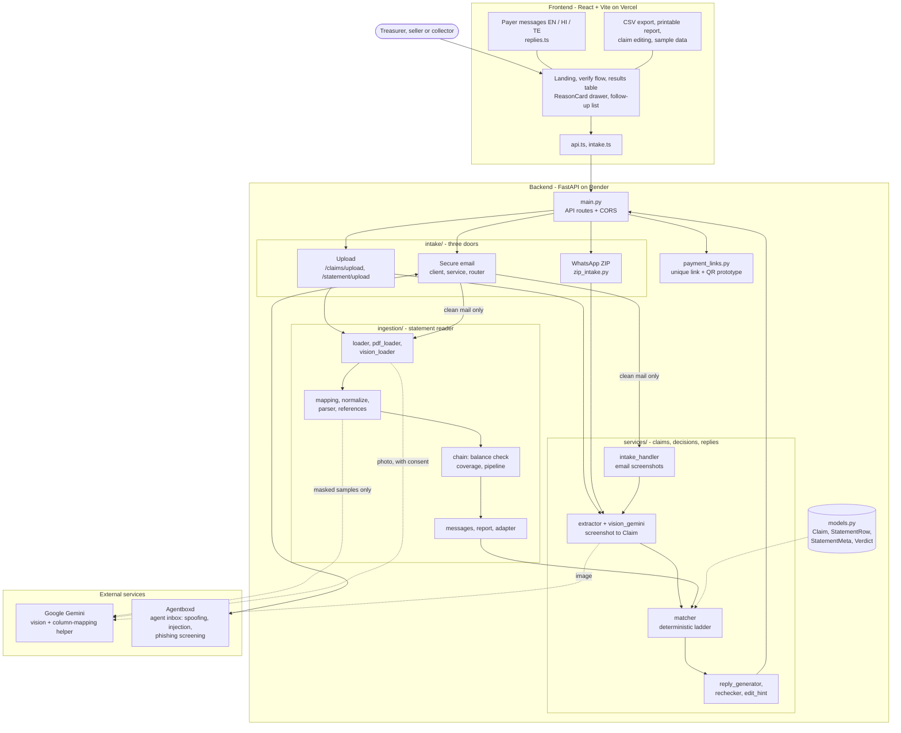
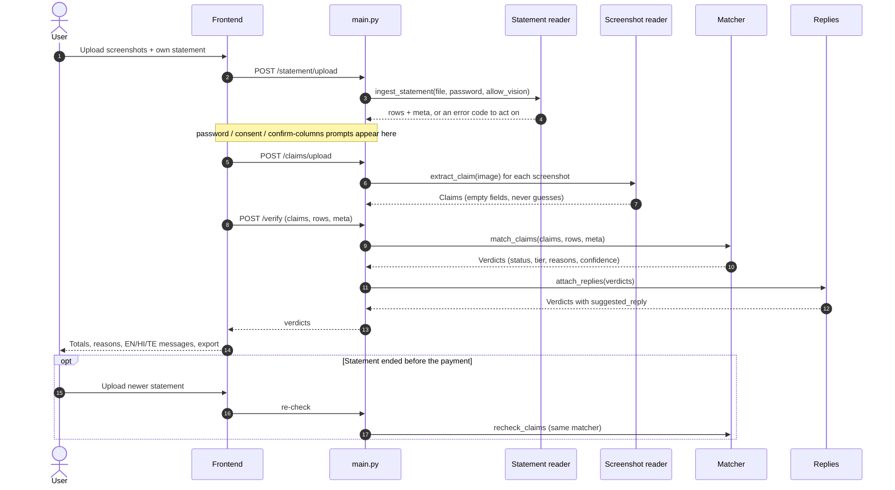
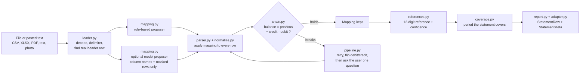
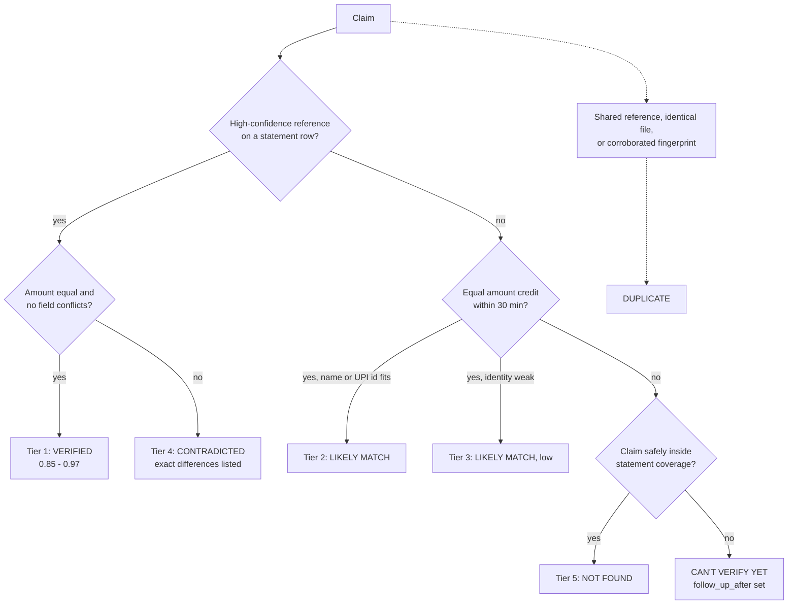
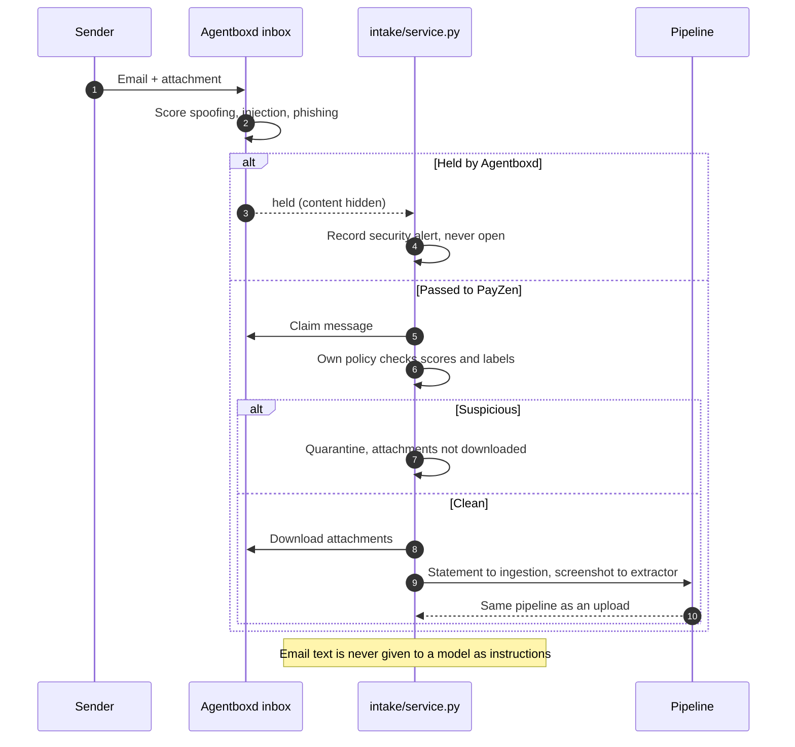
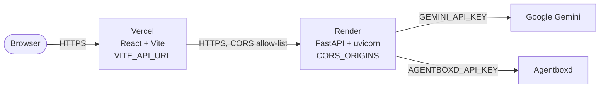

# Architecture

PayZen compares payment screenshots against the receiver's own statement and reports evidence-based verdicts. The statement is the stronger evidence. AI is used only to *read* (screenshots, unfamiliar statement layouts, photos of statements, email screening); every decision about a payment is deterministic code.

## 1. System overview

Solid arrows are data flow; dotted arrows leave the server (Gemini) or are shared contracts.

## 2. Verification flow

## 3. Statement reader: the model proposes, the arithmetic verifies

## 4. Matcher decision ladder

Global rules: one credit supports one claim (Hungarian assignment), only credits count as evidence, tiers 2 and 3 never verify, the same input always gives the same output. Details: [`technical-reference.md`](technical-reference.md).

## 5. Secure email intake

Design: [`secure-intake.md`](secure-intake.md).

## 6. Deployment

Everything is processed in memory; nothing is stored. Setup: [`deployment.md`](deployment.md).

## Components and owners

| Component | Location | Built by |
|---|---|---|
| Claim extractor, normalizers, image fingerprint | `backend/app/services/extractor.py`, `vision_gemini.py` | Alizah |
| Matcher / verdict engine (ladder, one-to-one assignment, duplicates, coverage) | `backend/app/services/matcher.py` | Alizah |
| Reply generator (evidence text, English, 3 tones), re-check, edit hint | `reply_generator.py`, `rechecker.py`, `edit_hint.py` | Alizah |
| Email screenshot handler | `backend/app/services/intake_handler.py` | Alizah |
| Statement ingestion (loader, PDF, vision, mapping, parser, normalize, references, balance chain, coverage, messages, adapter, report) and `services/ingestor.py` | `backend/app/ingestion/` | Zunairah |
| Secure email intake (Agentboxd client, service, router) and WhatsApp ZIP intake | `backend/app/intake/` | Zunairah |
| Payment link and QR prototype | `backend/app/payment_links.py` | Zunairah |
| API and shared contracts (`Claim`, `StatementRow`, `StatementMeta`, `Verdict`) | `backend/app/main.py`, `models.py` | Umaima |
| Web interface (landing, verify flow, results, reason drawer, follow-up list, exports) | `frontend/src/` | Umaima |
| Payer messages in English, Hindi and Telugu | `frontend/src/replies.ts` | Umaima |
| Evaluation data and scripts | `eval/`, `data/synthetic/` | Umaima |
| Ingestion, photo and email evaluations | `tests/ingestion/`, `tests/intake/` | Zunairah |
| Matcher, reply and re-check test suites | `tests/` | Alizah |

## Boundaries

- The extractor is the only component that touches screenshot bytes. It returns a `Claim` and keeps no copy.
- The matcher consumes only structured claims, rows and metadata. No I/O, no clock, no randomness. Replies are not produced here.
- The reply generator reads `Verdict` fields only; `attach_replies` returns copies.
- Re-check is a thin wrapper over the same `match_claims`; there is no second rule set.
- The edit hint has no path into a `Verdict`.
- Ingestion never duplicates matching logic; the matcher never compensates for ingestion behaviour.
- Email text is never given to a model as instructions; held mail is never opened.

## Guiding rule

Never produce a stronger verdict than the evidence supports. A false Verified is worse than a cautious Not found or Can't verify yet.

Field-level contract: [`api-contract.md`](api-contract.md).